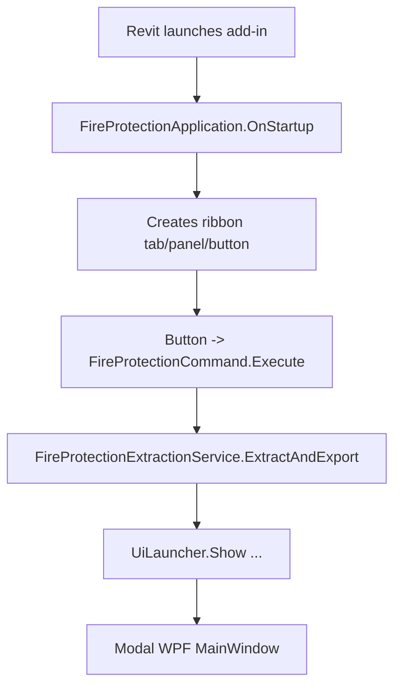
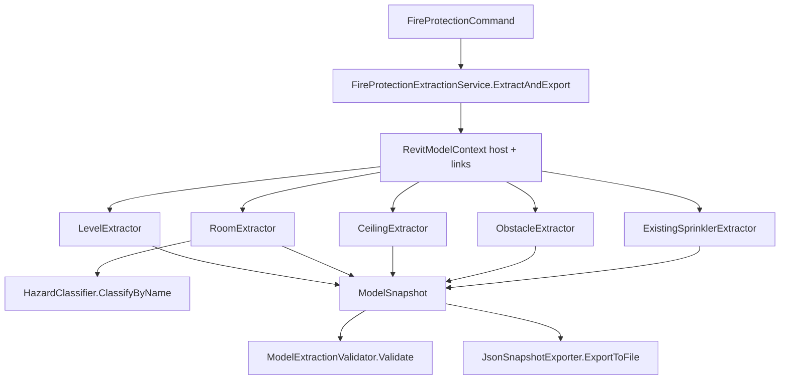
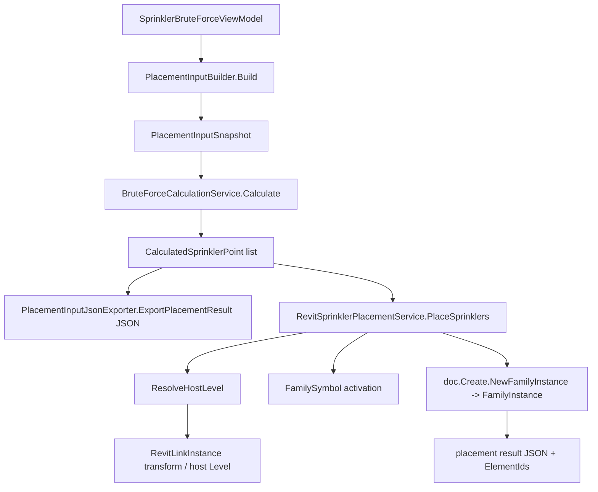

# FireProtectionSystem — Architecture

> Documents the **actual** architecture as observed in the source. Where the real flow differs from an
> idealized design, the real flow is recorded. "Snowdon" is a sample dataset name, not an integration.

## 1. Architecture Overview

A Revit add-in with a clear three-layer separation:

1. **Extraction** — reads the Revit model (host + linked), normalizes to host-MEP coordinates, emits
   a `ModelSnapshot` JSON. Revit-API-heavy, read-only.
2. **Calculation** — pure, Revit-free engine that turns a `PlacementInputSnapshot` into
   `CalculatedSprinklerPoint` coordinates. No Revit API.
3. **Placement** — Revit-API layer that turns calculated points into `FamilyInstance` elements.

The UI (WPF) is the presentation/selection layer. The **Backend references the UI** (one-way) so it can
construct concrete services and inject them through the UI constructor chain.

## 2. Solution Structure

```text
FireProtectionSystem.slnx
├── FireProtection.Backend   (extraction, calculation, placement, Revit entry points)
├── FireProtection.UI       (WPF, ViewModels, result models, service interfaces)
└── FireProtection.Tests    (console test harness, references Backend + UI)
```

## 3. Backend Architecture

- `Revit/` — `FireProtectionApplication` (ribbon), entry via `Commands/FireProtectionCommand`.
- `Services/Model/` — `RoomExtractor`, `CeilingExtractor`, `LevelExtractor`, `ObstacleExtractor`,
  `ExistingSprinklerExtractor`, `RevitModelContext`, `RevitLinkContext`, `SpatialHelpers`.
- `Services/Extraction/` — `FireProtectionExtractionService`, `IFireProtectionExtractionService`,
  `JsonSnapshotExporter`, `ModelExtractionValidator`.
- `Services/Placement/Sprinklers/Final/` — `PlacementInputBuilder`, `PlacementInputJsonExporter`,
  `RevitSprinklerPlacementService`, `RevitSprinklerFamilySource`, and `BruteForce/` subfolder
  (`BruteForceCalculationService`, `RoomGeometry`, `GeometryMath`, `BruteForceCalculationConfig`,
  `DefaultHazardPlacementRules`, `IHazardPlacementRules`, `HazardPlacementRuleSet`).
- `Models/DTOs/` — `ModelSnapshot`, `RoomData`, `LevelData`, `CeilingData`, `ObstacleData`,
  `ExistingSprinklerData`, `HazardData`, coordinate/bounding-box types.
- `Models/Hazard/` — `HazardClassifier`, `HazardClass`, `HazardResult`.

## 4. UI Architecture

- `Services/` — `UiLauncher`, `ISprinklerPlacementService`, `ISprinklerFamilySource`,
  `IPlacementInputExporter`.
- `Models/` — `FireProtectionUiData` (UI-side mirror of the snapshot), and `Sprinklers/BruteForce/`
  result models (`CalculatedSprinklerPoint`, `RoomCalculationResult`, `BruteForceCalculationResult`,
  `SprinklerPlacementResult`, `CandidatePoint`, `CalculationStatus`).
- `ViewModels/` — `MainWindowViewModel`, `Sprinklers/SprinklerViewModel`, `Sprinklers/BruteForce/
  SprinklerBruteForceViewModel`, `Sprinklers/Collision/SprinklerCollisionViewModel`,
  `SmokeDetectors/SmokeDetectorViewModel`, `NotificationAppliances/NotificationApplianceViewModel`,
  `Common/RelayCommand`, `Common/ObservableObject`.
- `Views/` — `MainWindow.xaml`, `Sprinklers/SprinklerView.xaml`, BruteForce/Collision/Smoke/
  Notification sub-views, and a `HazardClassToBrushConverter` + `SprinklerSubTabHeaderTemplateSelector`.

## 5. MVVM Structure

- `ObservableObject` / `RelayCommand` are the base MVVM primitives.
- `MainWindowViewModel` aggregates tab ViewModels: `SprinklerViewModel` (which contains
  `SprinklerBruteForceViewModel` and `SprinklerCollisionViewModel`), `SmokeDetectorViewModel`,
  `NotificationApplianceViewModel`.
- The BruteForce flow is the only fully wired feature; Collision/Smoke/Notification ViewModels are
  currently empty shells (constructor + a `Data` property only).

## 6. Revit API Integration



- `FireProtectionApplication` implements `IExternalApplication`; the `.addin` manifest registers only
  the Application add-in. The ribbon `PushButtonData` targets `FireProtectionCommand` by class name.
- `FireProtectionCommand` is `[Transaction(TransactionMode.Manual)]`; it performs read-only extraction
  (no transaction) and opens the modal UI. Actual element creation happens later inside the placement
  service's own transaction.

## 7. Extraction Architecture



Key rule: every linked-model point is transformed to host-MEP coordinates via
`RevitModelContext.TransformPoint(point, transform)` (and `TransformBoundingBox`/`TransformVector`)
during extraction. The calculation/placement layers never re-transform.

## 8. Placement Architecture



- `CalculatedSprinklerPoint` carries `X, Y, Z` (already host-MEP feet), `RoomId`, `LevelId`,
  `LevelName`.
- `RevitSprinklerPlacementService` resolves the host `Level` (handling linked-model `LevelId`s via
  `ResolveHostLevel`), optionally finds a ceiling host (`FindCeilingHost`), activates the `FamilySymbol`,
  and creates the instance inside a transaction.

## 9. Hazard Classification Architecture

`HazardClassifier.ClassifyByName(roomName)` → `HazardResult`. The result is attached to `RoomData`
(classification tagging). The **calculation** does **not** use hazard-specific engineering values:
`DefaultHazardPlacementRules.GetRules(hazardClass)` returns the **same** 15 ft provisional placeholder
for every class and sets `HasApprovedRules = false`. NFPA13-2022 hazard-specific rules are not present.

## 10. Snowdon Integration

**None.** No `Snowdon*` types exist. "Snowdon" is a sample project name in `extractTest.json` and a
design note in `TextFile1.txt`. Do not assume a Snowdon provider exists.

## 11. Data Flow

```text
Revit model (host + linked)
   ↓  Extractors (RevitModelContext transforms linked geometry to host coords)
ModelSnapshot (JSON)
   ↓  FireProtectionCommand serializes to JSON string
FireProtectionUiData (UI deserializes)
   ↓  User selects rooms -> PlacementRoomSelection
PlacementInputSnapshot (PlacementInputBuilder)
   ↓  BruteForceCalculationService
CalculatedSprinklerPoint (X/Y/Z)
   ↓  RevitSprinklerPlacementService
FamilyInstance (Revit)  +  placement result JSON
```

## 12. UI → Backend Flow

The UI never references Backend assemblies. Concrete Backend services are created in
`FireProtectionCommand` and injected:

```text
FireProtectionCommand
   → UiLauncher.Show(json, inputExporter, sprinklerFamilySource, placementService)
   → MainWindow(json, inputExporter, sprinklerFamilySource, placementService)
   → MainWindowViewModel(...)
   → SprinklerBruteForceViewModel(..., sprinklerFamilySource, placementService)
```

The UI depends only on the **interfaces** `ISprinklerPlacementService`, `ISprinklerFamilySource`,
`IPlacementInputExporter` (all defined in `FireProtection.UI/Services/`).

## 13. Extraction Flow (step-by-step)

1. Obtain active `Document`.
2. `RevitModelContext` discovers host + linked documents.
3. `LevelExtractor` extracts levels (host + links), maps elevations.
4. `CeilingExtractor` collects ceilings, classifies slope/type, computes elevations.
5. `RoomExtractor` extracts rooms (outer/inner loops, boundaries), classifies hazard, associates
   ceilings; obstacles and existing sprinklers are associated to rooms via `SpatialHelpers`.
6. `ModelSnapshot` is assembled, validated (`ModelExtractionValidator`), and exported
   (`JsonSnapshotExporter`).
7. Per-room failures produce warnings and do **not** abort the whole extraction.

## 14. Placement Flow (step-by-step)

1. User selects rooms in the UI → `SprinklerBruteForceViewModel` builds `PlacementRoomSelection` items.
2. `PlacementInputBuilder.Build` produces a `PlacementInputSnapshot`.
3. `PlacementInputJsonExporter.CalculateBruteForce` runs `BruteForceCalculationService.Calculate`
   (fine 1 ft candidate grid + 15 ft greedy selection; Z from level/ceiling).
4. `RevitSprinklerPlacementService.PlaceSprinklers` resolves the host level, finds a ceiling host if
   possible, activates the symbol, and creates `FamilyInstance`s in a transaction.
5. Results (placed/failed, `ElementId`s, diagnostics) are returned and exported to
   `sprinkler_placement_result_*.json`.

## 15. Important Interfaces

- `IExternalApplication` — `FireProtectionApplication` (ribbon).
- `IExternalCommand` — `FireProtectionCommand` (button action).
- `IFireProtectionExtractionService` — extraction contract.
- `ISprinklerPlacementService` — placement contract (UI side).
- `ISprinklerFamilySource` — resolves available sprinkler families/types from the host document.
- `IPlacementInputExporter` — `ExportInput`, `CalculateBruteForce`, `ExportPlacementResult`.

## 16. Important Dependencies

- `Newtonsoft.Json` 13.0.4 (both Backend and UI).
- RevitAPI / RevitAPIUI (per-version `HintPath`, `Private=False`).
- `FireProtection.Backend` → `FireProtection.UI` (ProjectReference). `FireProtection.UI` does **not**
  reference Backend.
- `FireProtection.Tests` → Backend + UI.

## 17. Transaction Boundaries

- Extraction: **no transaction** (read-only; model never dirtied).
- `FireProtectionCommand`: `[Transaction(TransactionMode.Manual)]` — does not start a transaction.
- Placement: `RevitSprinklerPlacementService` opens its own transaction when creating `FamilyInstance`s.

## 18. External/System Dependencies

- Autodesk Revit (2024/2025/2026) with the add-in deployed to
  `%APPDATA%\Autodesk\Revit\Addins\<version>` (done by the `DeployToRevit` build target, which also
  writes `FireProtectionSystem.addin`).
- Specific sprinkler `Family`/`Type` must exist in the host document for placement to succeed
  (resolved by `RevitSprinklerFamilySource`).

## 19. Architectural Constraints

- One-way dependency: Backend → UI only.
- Coordinate normalization happens once, at extraction; no second transform in placement.
- Calculation engine is fully Revit-free (testable without Revit).
- Separation of extraction / calculation / placement responsibilities.

## 20. Potential Architectural Risks

- The UI depends on Backend-constructed services injected via long constructor chains; any change to
  `UiLauncher.Show`/`MainWindow`/`MainWindowViewModel` signatures ripples through.
- Collision / Smoke / Notification tabs are empty shells; wiring exists but logic is absent.
- Provisional spacing means every result is `ReviewRequired`; no compliant output yet.
- Linked-level resolution and linked-ceiling hosting are partial (host-document fallback only).

## Related Documentation

- [[PROJECT_CONTEXT]]
- [[DECISIONS]]
- [[PROGRESS]]
- [[TODO]]
- [[SESSION_NOTES]]
- [[SPRINKLER_POINT_CALCULATION_EXPLAINED]]
