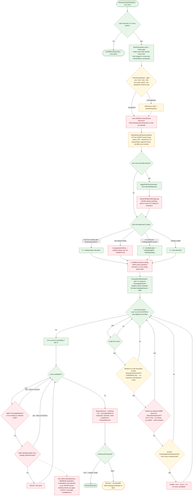
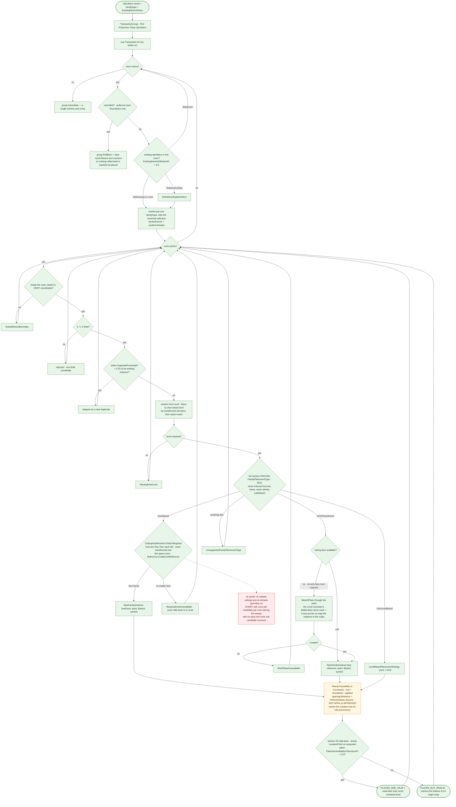

# Sprinkler point detection & placement — current code vs. production-grade

## How to read this

Diagrams 1-3 are **the code as it exists today**. Nothing in them is aspirational.
Diagram 4 is **the target**. Nothing in it exists yet.

Every node in diagrams 1-3 carries one of three states:

| State | Colour | Meaning | Blocked on the standard? |
|---|---|---|---|
| SOUND | green | production-shaped, keep as-is | — |
| PROVISIONAL | amber | runs, but the value or the classification scheme is a placeholder | **yes** — needs the senior engineer + the applicable standard/edition |
| DEFECTIVE | red | wrong or missing no matter which standard applies | **no** — fixable today |

That last column is the answer to "how do we deal with standards right now": the red nodes are not blocked
on anyone, and there are more red nodes than amber ones.

---

## The brutally honest state of it

1. **Hazard class currently has zero effect on the output.** `DefaultHazardPlacementRules.GetRules` ignores
   its `hazardClass` argument for every numeric field — one `const double placeholderSpacingFt = 15.0`,
   `CoverageRadiusFt = 15/2`, clearances `1.0`. A Light-hazard office and an EH2 area produce an identical
   grid. Hazard class survives only as a JSON label and as the thing that forces `ReviewRequired`.
2. **There is no NFPA-13 in the system.** `"NFPA13-2022"` is stamped into the snapshot and
   `PROVISIONAL RULES - NOT NFPA-13 APPROVED` into the element Comments. The Comments marker is the only
   honest one of the two.
3. **The pluggable seam is not actually plugged in.** `IHazardPlacementRules` exists and is well documented,
   but `PlacementInputJsonExporter.cs:168` does `new DefaultHazardPlacementRules()` at the call site — the
   shape of injection without injection: one implementation, no way to pass another in.
4. **The per-room override UI overpromises.** Decision 018 lets a user type any spacing;
   `ClampToNfpa13MaxSpacing` silently clamps anything above 15 ft and continues. The UI implies control that
   the engine quietly overrides.
5. **Approved numbers alone would not make it correct.** With a real NFPA-13 table dropped in tomorrow, the
   engine would still enforce max spacing as a *minimum* separation, still never verify the room is fully
   covered, still model only a minimum wall distance, still grid on world axes, and still drop room holes.
   The rule layer is necessary and **not sufficient**.

What *is* genuinely production-grade: the Revit half — transaction grouping and rollback, proven
`FamilyPlacementType` strategy dispatch with no silent substitution, linked-model coordinate discipline,
host/level read-back, and the section-23 post-placement validation. That layer is not the problem.

---

## 1 · Master pipeline — CURRENT CODE

```mermaid
flowchart TD
    START(["User clicks the Fire Protection ribbon button"]) --> E1

    subgraph EXTRACT["EXTRACT · once, at command start · FireProtectionExtractionService"]
        direction TB
        E1["ConfigureDisplayUnits · SpecTypeId.Length to UnitDisplay"]
        E2["LevelExtractor + CeilingExtractor<br/>host document AND every RevitLinkInstance"]
        E3["RoomExtractor · Finish boundary · link.TotalTransform on every point<br/>loop 0 to OuterLoop, loops 1..n to InnerLoops"]
        E3b["room height fallback chain<br/>bbox, then UnboundedHeight, then a hardcoded 20 ft"]
        E4["HazardClassifier.ClassifyByName<br/>keyword table to Light / OH1 / OH2 / EH1 / EH2<br/>sets RequiresHumanReview"]
        E5["ObstacleExtractor · 7 fixed categories INCLUDING walls"]
        E5b["ExistingSprinklerExtractor · OST_Sprinklers"]
        E6["Associate obstacles to rooms · bbox XY + Z overlap<br/>Associate existing heads to rooms · point-in-room XY"]
        E1 --> E2 --> E3 --> E3b --> E4 --> E5 --> E5b --> E6
    end

    E6 --> SNAP[("ModelSnapshot · also exported to JSON<br/>all lengths decimal feet")]

    subgraph UISEL["SELECT · SprinklerBruteForceViewModel · modeless WPF"]
        direction TB
        U1["Level and Room rows · all checked by default"]
        U2["per row: hazard class, family + type from the Excel catalog D017,<br/>spacing / clearance overrides D018"]
        U3["CollectSelectedRooms / CollectAllVisibleRooms<br/>carries a single FLAT Polygon — inner loops not carried"]
        U1 --> U2 --> U3
    end

    SNAP --> U1
    U3 --> B1["PlacementInputJsonExporter.BuildSelections<br/>rehydrate RoomData from FullRoomJson · filter obstacles + existing heads"]
    B1 --> B2["PlacementInputBuilder.Build<br/>Standard = NFPA13-2022 as a literal"]
    B2 --> B2b["Boundary = Polygon + OuterLoop only<br/>InnerLoops NEVER populated — holes die here"]
    B2b --> B3[("PlacementInputSnapshot")]
    B3 --> CALC["CALCULATE · BruteForceCalculationService.Calculate<br/>Revit-free and deterministic — diagram 2"]
    CALC --> FORK{"which entry point ran it?"}

    FORK -->|"eligibility sweep"| G1["EvaluateRoomEligibility · read-only, no transaction<br/>reuses the same resolvers placement uses"]
    G1 --> G2{"outcome per room"}
    G2 -->|ELIGIBLE| G3["row stays checked"]
    G2 -->|BLOCKED| G4["greyed out · MissingRoomGeometry · NoCandidatePoints<br/>MissingHostLevel · NoUsableCeilingHost · UnsupportedFamilyPlacementType"]
    G2 -->|UNDETERMINED| G5["greyed out · CalculationFailed · PreflightError · family not found<br/>a config or infra failure is never reported as BLOCKED"]
    G3 --> U2
    G4 --> U2
    G5 --> U2

    FORK -->|"placement run"| P0["ProbeMissingFamilies then MissingFamiliesModal"]
    P0 --> P1["RevitApi.Run — a modeless handler cannot open a Transaction"]
    P1 --> P2["PLACE — diagram 3"]
    P2 --> R1[("SprinklerPlacementResult + JSON + summary dialog")]

    classDef sound fill:#e8f5e9,stroke:#2e7d32,color:#14361c
    classDef prov fill:#fff8e1,stroke:#ef6c00,color:#4a2c00
    classDef bad fill:#ffebee,stroke:#c62828,color:#5f1114
    class E1,E2,E3,E5b,E6,SNAP,U1,U2,B1,B3,CALC,FORK,G1,G2,G3,G4,G5,P0,P1,P2,R1 sound
    class E4,B2 prov
    class E3b,E5,U3,B2b bad
```

---

## 2 · Candidate calculation — CURRENT CODE · `BruteForceCalculationService.CalculateRoom`

---

## 3 · Placement — CURRENT CODE · `RevitSprinklerPlacementService.PlaceSprinklers`

This is the half that is already production-shaped. Only three nodes are red, and none of them are engineering.

---

## 4 · TARGET — none of this exists yet

Blue dashed = to build. Amber = data the senior engineer authors, never us. Green = existing code reused as-is.

```mermaid
flowchart TD
    subgraph DATA["DATA · authored by the senior engineer against the actual standard"]
        direction TB
        D1[("project design basis<br/>standard + edition + AHJ amendments · selected per project")]
        D2[("versioned rule document, beside the family catalog · D017/D020 pattern<br/>declares its own units, converted on load<br/>rounding always toward the conservative side<br/>provenance per field: standard, edition, table/clause")]
        D1 --> D2
    end

    D2 --> LOAD["ApprovedRuleProvider : IHazardPlacementRules<br/>validated on load · HasApprovedRules true only when every<br/>field this run needs is present and approved"]
    DEF["DefaultHazardPlacementRules kept as the explicit<br/>nothing-approved-yet provider so the tool still runs"] --> INJ
    LOAD --> INJ["provider INJECTED into PlacementInputJsonExporter<br/>replaces new DefaultHazardPlacementRules at the call site"]

    INJ --> KEY{"resolve the rule set by a composite key"}
    KEY --> K1["hazard / occupancy class<br/>the SCHEME itself is data, not an enum:<br/>NFPA Light-OH1-OH2-EH1-EH2 vs EN 12845 LH-OH1..4-HHP-HHS"]
    KEY --> K2["sprinkler type, orientation, response<br/>pendent / upright / sidewall / extended-coverage / ESFR / residential"]
    KEY --> K3["ceiling and construction condition<br/>slope, obstructed vs unobstructed, high ceiling, concealed space"]
    K1 --> RS
    K2 --> RS
    K3 --> RS
    RS[("rule set for THIS room")] --> SC["scalars<br/>max coverage area per head · MAX spacing between heads<br/>MIN and MAX distance to a wall · min head-to-head separation<br/>deflector distance below the ceiling"]
    RS --> PR["predicates — cannot be expressed as doubles<br/>IsObstructionClear(obstruction, point)<br/>MaxDistanceToWall(spacing, condition)<br/>ExtraHeadsRequired(ceilingCase)"]

    SC --> ENG
    PR --> ENG
    ENG["rewritten candidate engine<br/>room-aligned anisotropic grid · oriented obstacle boxes + Z band<br/>per-ceiling regions including slopes · InnerLoops threaded end to end<br/>deflector offset applied to Z"]
    ENG --> VER{"coverage verification per room<br/>uncovered area · worst pairwise spacing · worst wall distance"}
    VER -->|fails| FAILR(["BLOCKED or ReviewRequired, with the measured shortfall"])
    VER -->|passes| GATE{"every rule field used by this run approved?"}
    GATE -->|no| PROV(["ReviewRequired · stamp PROVISIONAL · refuse to claim compliance"])
    GATE -->|yes| OKR(["Success · stamp standard + edition + rule-set version<br/>+ per-point reason record so a reviewer can audit without re-running"])

    REV["Revit half reused unchanged: transactions, proven-type strategy<br/>dispatch, host/level read-back, section-23 validation<br/>+ ceiling cache and a link-unique eligibility cache key"] --> OKR

    classDef newwork fill:#e3f2fd,stroke:#1565c0,color:#0b3d70,stroke-dasharray: 5 4
    classDef data fill:#fff8e1,stroke:#ef6c00,color:#4a2c00
    classDef reuse fill:#e8f5e9,stroke:#2e7d32,color:#14361c
    class D1,D2 data
    class LOAD,INJ,KEY,K1,K2,K3,RS,SC,PR,ENG,VER,GATE,OKR,PROV,FAILR newwork
    class DEF,REV reuse
```

---

## 5 · Gap register — split by whether the standard blocks us

### 5a · RED · not blocked on any standard, wrong today, fixable now

| # | Gap | Site | Why it is wrong regardless of standard |
|---|---|---|---|
| 1 | max spacing enforced as a **minimum** separation | `BruteForceCalculationService.cs:321` | every standard states max spacing as an upper bound; the code rejects candidates that are *closer* than it, so gaps can exceed it |
| 2 | no coverage verification; `RequiredCount` never compared | `CalculateRoom` | under-coverage is silent whatever the numbers are |
| 3 | room holes dropped | `PlacementInputBuilder.Build`, UI flat `Polygon` | `RoomGeometry` already supports holes; nothing reaches it. Shafts and atria get heads |
| 4 | obstacles as 2D world-axis AABBs, no Z band, walls included | `BuildObstacleBoxes`, `ObstacleExtractor` | a floor pipe blocks a ceiling head; a diagonal wall's AABB blankets the room |
| 5 | rule provider `new`-ed at the call site | `PlacementInputJsonExporter.cs:168` | the interface cannot be swapped, so no standard can be plugged in at all |
| 6 | override above the ceiling is silently clamped | `ClampToNfpa13MaxSpacing` | it should be refused with a status code; silent clamping hides user intent |
| 7 | `Score = 1.0` for every candidate — no objective | `CalculateRoom` | selection is arbitrary among valid points |
| 8 | world-axis grid in rotated rooms | `ComputeGridResolution` + bbox scan | output does not look like a designed layout in any standard |
| 9 | no ceiling cache, no early exit in the sweep | `CeilingHostResolver` | re-collects and re-extracts geometry per candidate per room — the scalability risk |
| 10 | eligibility cache key not link-unique | `RevitSprinklerPlacementService.cs:347` | collisions across linked models |
| 11 | invented 20 ft room-height fallback | `RoomExtractor.cs:166` | a made-up number feeding ceiling matching |
| 12 | sloped ceilings unsupported; one Z per room | `CalculateRoom` | a missing capability, not a missing number |

### 5b · AMBER · genuinely blocked on the senior engineer + the applicable standard

| # | What must be supplied | Currently |
|---|---|---|
| 1 | which standard and edition applies, per project | `"NFPA13-2022"` literal in `PlacementInputBuilder.Build` |
| 2 | the hazard/occupancy **scheme** and its classes | five-value enum + `ParseHazardClass` switch + `HazardClassifier` keyword table |
| 3 | max coverage area per head and max spacing, per class × sprinkler type × ceiling condition | one 15 ft placeholder for every class |
| 4 | min **and max** distance to a wall | only a minimum (`BoundaryClearanceFt`) exists |
| 5 | min head-to-head separation as a quantity distinct from max spacing | conflated; both derived from the same 15 ft |
| 6 | obstruction rule geometry per obstruction type and sprinkler type | one uniform `ObstacleClearanceFt = 1.0` |
| 7 | deflector distance below the ceiling | does not exist anywhere in the pipeline |
| 8 | ceiling slope / obstructed construction / high ceiling / concealed space treatment | sloped ceilings flagged unsupported |
| 9 | sprinkler orientation and response tables | no orientation concept at all |
| 10 | design density / area of operation as the recorded design basis | not modelled |

**Sequencing that follows from this split:** 5a is twelve items of ordinary engineering work that can start
immediately and would each be an improvement under any standard. 5b cannot start until the rule document is
authored — but we can build the loader, the schema, the validation and the `HasApprovedRules` gate against a
fixture file, so that when the values arrive nothing but data changes.

No numeric fire-protection rule is asserted in this document. Every value named above is a placeholder that
must be supplied and verified by the senior engineer against the applicable standard and edition.

